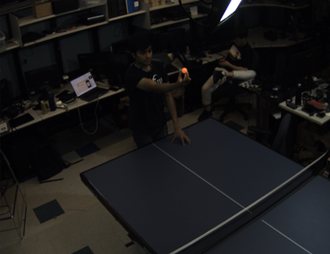
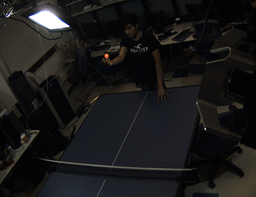
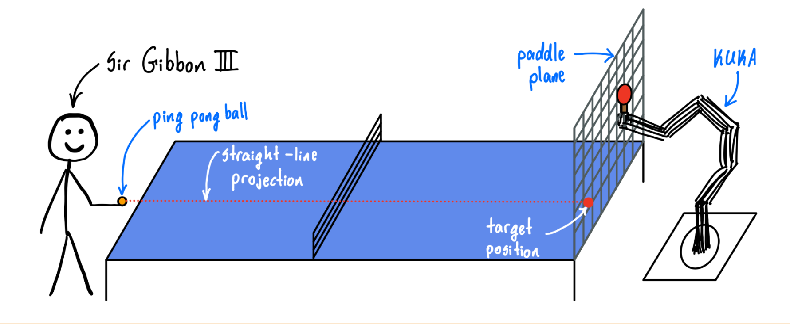

# Hardware design
Our KUKA arm contains 7 revolute joints, and the ping pong paddle is connected to the end effector of our robot with a laser-cut wooden mount. Joint Control can be done by using  ROS2. For our KUKA arm, we also have a physical controller. To take full control of the robot using our lab PC, we change the mode from  *T1* (manual control) to *AUT* (Automated control) mode. Then, we kill the existing processes and reconnect to the application  *LBRServer*  with the selected remote IP address. After setting the send period and choosing  *position controller*, we can take control of the KUKA arm using plan and execute commands in RViz as well as with our custom controller. All of this can be seen in the video below.

### And here's video about how to control KUKA arm hardware!
<iframe width="730" height="350" src="//youtube.com/embed/ZsRinlzt6Ig" frameborder="0"> </iframe>

# Software design

## Vision & Sensing
We use four cameras to view the table from different angles. For all four cameras, on every frame, two things happen. First, a mask is applied to filter out everything except for orange pixels (the color of the ping pong ball). Then, the OpenCV Hough Circles algorithm  is used to find any circles (the approximate shape of a ping pong ball) in the image. This particular algorithm works by computing all the edge pixels in the masked image. Then, for every edge pixel, it computes the gradient vector at that pixel and considers all possible circles whose center is in the direction of the gradient with a radius that intersects this edge point. It finally returns the circle that would hit the most edge pixels. After computing the ball position in all four camera frames, we triangulate the position of the ball in the world coordinates.

      
  
 
      
  
 

As you might see in the pictures above, our team member *Anish* is holding a orange color ping pong ball on his hands. You can see that camera detects the ball correctly as there is a red circle surrounding the ball and picks up nothing else.

## Planning
Since we had to scrap our initial work on having the cameras predict the ball’s parabolic trajectory (due to camera latency), we instead fed target positions to the KUKA arm by projecting the position of the ball onto the paddle frame. We also apply a low pass filter here to reduce noise. Here's our hand-drawn visualization of design for path planning:

## Actuation & Controller
Similar to other robot arms (e.g. Sawyer bot), KUKA arm also supports the _Moveit!_ controller, which is a widely used robotics manipulation platform. However, there exists a severe problem with _Moveit!_ controller;  _Moveit!_ controller is too slow for the KUKA robot arm to acquire our desired speed to hit the high-speed ping-pong ball. In addition to that, since there exists compatibility issues our research team moved back and forth between the ROS2 foxy version (used for physical robot control) and ROS2 humble version (used for Gazebo simulation) for our KUKA control code.

To resolve this issue and make our KUKA arm to successfully reach our endgame goal, we implemented the custom joint controller based on kinpy package.

We ended up using Inverse Kinematics to compute the joint trajectories given the trajectory of our goal position computed in the planning phase. Along with using IK to compute the desired jointspace coordinates for the robot to move towards, we needed to compute the time required to move the robot to that jointspace configuration. We did this by finding the joint that would take the longest to reach the goal configuration from the current configuration, given a fixed maximum velocity for each joint. This can be phrased as the optimization problem below. We also applied some additional limitations here to avoid the robot from going into an inaccessible jointspace configuration.

\\[ t^* = \min_{t \in \mathbb{R}, t>0} t \\]
\\[
    \text{s.t. } \frac{|\theta_i - \theta_i^*|}{v_i} \leq \hspace{0.1cm} \forall i \in \\{1, \cdots, 7\\}
\\]

