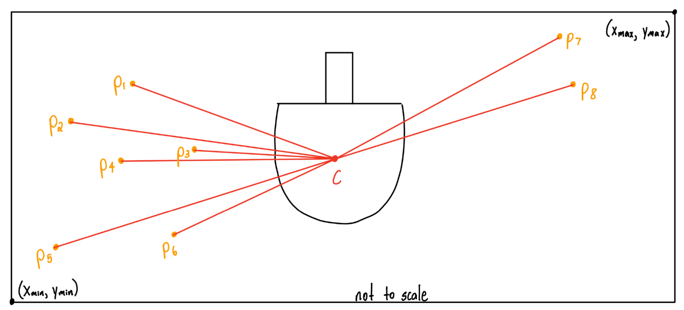

Our future plans with this project are to get the KUKA Arm to successfully intercept an incoming ping pong ball served by a human player.
To accomplish this, we anticipate solving optimization problems such as the one sketched out on the figure above, which minimizes the sum of distances of the predictions (which will come out of eight parallelized neural networks) to the center of the ping pong paddle. 

A reformulated optimization problem would be to find the position of the paddle that minimized the sum of distances of the predictions to the perimeter of the paddle, as opposed to the center of the paddle:

\\[ c = \begin{bmatrix}c_x \\\\ c_y\end{bmatrix} \\]
\\[
    \min_c \sum_{i=1}^8 ||c-p_i||_2
\\]

\\[
    \text{s.t. } x_{\min} \leq c_x \leq x_{\max}  \hspace{0.2cm} \wedge \hspace{0.2cm} y_{\min} \leq c_y \leq y_{\max}
\\]

where each $$p_i = \begin{bmatrix} p_{ix} \\\\ p_{iy} \end{bmatrix}$$ is the predicted end point of the ping pong ball when it is flush to the robot's edge of the table.

Then, our optimal $$c^*$$ can be represented as:
\\[
  c^* = \begin{bmatrix} \frac{1}{8} \sum_{i=1}^8  p_{ix}\\\\ \frac{1}{8} \sum_{i=1}^8  p_{iy}\end{bmatrix}
\\]