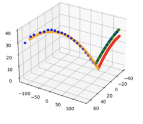

# Software Implementation

## Live Update
We implemented live update code to predict the position at which the paddle will intercept the ball based on the data from the cameras. To precisely predict the post-hit trajectory, we fit a curve--quadratic in z, linear in x and y--given the orientation of the spatial frame located at the center of the table to the ball position data points (computed from the camera images) after the ball is hit by the player but before it bounces on the table. The coefficients of this curve are used to generate the coefficients for a new curve that the ball is predicted to follow after bouncing on the table. You can find the code we implemented for our curve fitting: [Curve Fitting Code](../curve_fitting)

We are using a linear regression model for this prediction task (although we have a non-linear model, the data points for these nonlinearities go in the data matrix which we run least-squares on to attain the coefficients to the parabolic equations) 

Based on this implementation and our test results, the average error of our prediction is around 6 inches, which was sufficient enough for the paddle to make contact with the ball in simulation, given a small amount of adjustment time after the ball bounces on the table.

The figure on the right compares the predicted trajectory against the true trajectory: 

Here are some detailed explanations on our trajectory figure:
- The blue points are the data points of the ball positions
- The orange curve is the trajectory of the ball before it bounces on the table (fit from the data points)
- The green curve is the true trajectory of the ball after it bounces on the table
- The red curve is the predicted trajectory of the ball after it bounces on the table, based on the trajectory of the ball before it bounces on the table

We found that most of the error is caused by the predicted curve being slightly lower than the true curve, which comes from noise in predicting the ball positions based on the camera frames. Even with this noise present, the overall prediction is still decent.

### And here's our live update simulation video!
<iframe width="730" height="350" src="//www.youtube.com/embed/5fMJRKkqF9g" frameborder="0"> </iframe>

In this video above, you can see the body frame of the human player on one side of the ping pong table and a circle representing the ping pong paddle affixed to the end effector of the KUKA arm flush with the other side of the table. In the video, a ball approaches the human player who then returns the ball with a swing and live updates on the ball's position continuously updates the planned trajectory of the ball based on our linear regression model. Ultimately, the paddle is able to intercept the ball swung by the player by the time it reaches the other end of the table. Note that this is a real situation gathered from testing.

## Jacobian Joint Controller
We decided to implement our own custom controller because 1) the moveIt controller was too slow for the KUKA robot arm to acquire our desired speed and 2) we had compatibility issues as our research team moved back and forth between the ROS2 foxy version and ROS2 humble version for our KUKA control code. As a separate team works on figuring out how to resolve compatibility issues so that we can actually test our KUKA arm via our ROS2 code, we set up a virtual box container so that we can try testing the joint movement in simulation (using RViz and Gazebo). We confirmed that the simulation movement aligns with our robot using the joint trajectory executioner node, one of the demo files of LBR-Stack demos for KUKA's Fast Robot Interface. 

After the team was able to resovle the compatibility and connction issuet between our lab computer and KUKA arm, we initially tried to implement the joint controller by manually calculating the Jacobian and finding the joint velocities for all 7 joints of the KUKA arm, but last week, we found and tested a  kinpy package which has a function that calculates the Jacobian directly from our urdf file. Here's our implmentation of joint controller based on kinpy package and LBR executioner node: [joint controller code](../Joint_Controller).

## IK Controller
Even though our implementation of jacobian-based joint controller seemed to be correct theoretically, Jacobian control was causing the KUKA arm to self-collide. In addition to that, it had trouble driving the error completely to zero when it didn’t self collide. To resolve this issue, we tried to tune different parameters in our code--from publication rate to the gain. We also tried applying nonlinear modifications to the joint velocities. However, none of these strategies worked, so we decided to switch from Jacobian control to using Inverse Kinematics. Here's our implementation of ik controller: [ik controller code](../IK_controller).

Through this implementation, we were able to resolve self-collision issue. However, our IK Controller sometimes sending a command to the robot that caused it to mysteriously crash with an obtuse error message. To make sure that we don't have thie crash issue, we scaled the joint velocities to make sure they were all within the safe range. We also capped the joint positions to make sure that none of the joints were overextended.

## Visual Servoing
After fully testing IK controller, the last step of our project was integrating our controller with visual servoing. Visual servoing is a vision-based control where visual information from a camera is used to control the motion of a robot or a system. It involves using visual feedback to guide the movement of a robot toward a desired target or to perform a specific task. As our robot arm control is based on the trajectory of the ping pong ball on our ping pong table, impelmenting visual servoing was a ncessary final step. Here's our implmentation of visual servoing control implementation: [Visual Servoing Contol Node](../Visual_servo_node).

