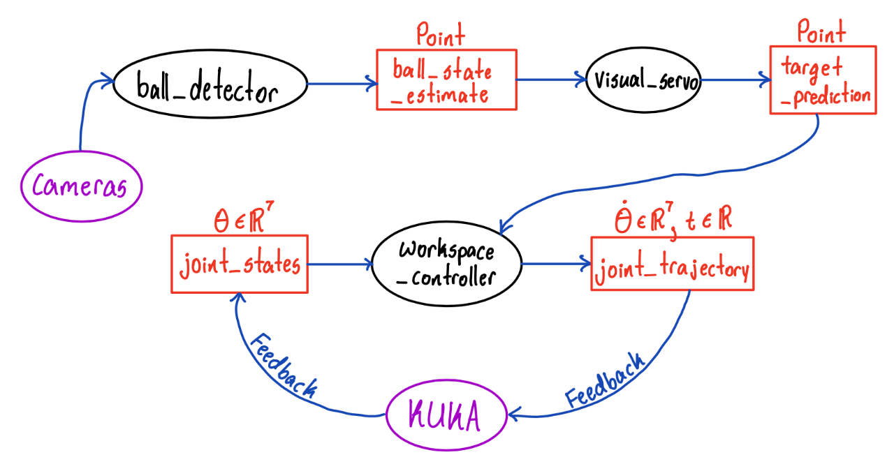

## Here's our project demo video!
<iframe width="730" height="350" src="//www.youtube.com/embed/5y1WLJMEGgo" frameborder="0"> </iframe>

Our final ROS2 code has three primary nodes, the ball_detector, visual_servo, and workspace_controller nodes. 

- The ball_detector node gets image data from the four cameras, and uses computer vision to locate the ball in world coordinates. 
- The visual_servo node computes the location of the target position. 
- The workspace_controller node sends joint trajectories to the KUKA, based on its current joint angles and the desired target position.

Here's our hand-drawn graph visualization of our ROS2 nodes and topics:

# Conclusion
## Result Analysis
As shown in the demo video, we were able to make the robot paddle of KUKA arm follow the position of the ball at a distance!

## Difficulties and Solution
### Controller Node Issues
There were two major issues regarding our controller node:

1) The controller node wasn’t getting any feedback input from the KUKA arm.
2) The controller node wasn’t able to send commands to the KUKA arm.

To resolve 1), we replaced the topics that the LBR FRI Stack demos use with the `/joint_states` topic. For the solution of 2), we first tried replacing the topics used in the LBR FRI Stack demos with an `rclpy ActionClient`. But, this caused issues with blocking, which prevented our node from being able to publish more than one command. We then switched to publishing directly to the underlying topic that the `ActionClient` was communicating with.

### Weird KUKA Sensor Bug
While computing the joint positions, we found tha our Forward Kinematics code was not computing the joint positions properly (i..e., the output from our FK computations did not line up with what TF/RViz were saying). First, we thought this was an issue with the URDF file we were using, so we tried downloading a new one, but the same issue persisted. Then, we thought it was an issue with the kinematics library we were using (kinpy), so we tried switching to another one (optas), but the issue still persisted. Then, we realized that the issue was that the joint angles being reported by the KUKA sensors were not in the correct order. We expected them to be in increasing order, but the  real order was 1, 2, 4, 3, 5, 6, 7  (joints 3 and 4 flipped).
 

### Localization 
One of the biggest difficulties we had as a part of our project was localization as we had issues with computing the relative transform between the world frame (center of table) that the vision code was computing the ball position with respect to and the KUKA base frame that the control code uses.

We wanted to do this by using the cameras to get the position of the KUKA arm’s end effector by viewing an AR Tag attached to the arm. The issue is that the `AR Tag Alvar package` is not supported in ROS2, which we needed to use to communicate with the KUKA. There is an `Aruco Marker` package that you can use in place of AR Tags, but this uses a version of OpenCV that is not compatible with the version of OpenCV that the rest of the research team requires for other computer vision code. 

In addition to that, Calibration matrix that has been used within our research team was incorrect.

Our initial proposal to resolve this issue was writing the code for the AR Tags in ROS1, and then using a bridge to transmit the information through a topic to the rest of our code in ROS2. However, we were not able to implement this due to time constraints and infrastructure issues. Instead, we measured the relative distances physically using a measuring tape and then did additional calibration later on, which ended up working extremely well. This was an effective approach for our project as the robot base frame is fixed such that we only need to localize the paddle in the zero configuration.

We hope to keep investigating issue futher in the upcoming semester by refining calibration matrix and resolve OpenCV version issue so that we can check if the usage of aruco marker is the valid option for our localization.

### Integration between Controller and Vision
When integrating control with vision, we faced several issues in parallel. First, the frequency at which we were able to detect the ball was very low. Second, the ball detection was fairly noisy. Third, the cameras had high latency, with a delay of almost 2 seconds. Especially, the third issue was a major barrier to getting the robot to hit a ball in motion, because by the time the cameras fed the first frames of the ball to the robot, the ball was already all the way across the table.

For the first issue within frequency, we actually realized it was because the cameras were not synchronizing properly. After changing the synchronization code, we were able to do detection at a much higher frequency. To modify noise correctly, we applied a low pass filter to the ball position prediction, which reduced the high frequency noise.

For the latency isue, this was unforunately outside of the scope of our work on this research project, we were not able to solve this issue. So, we modified our project goal to have the robot paddle follow the position of the ball at a distance, instead of trying to hit an approaching ball.
