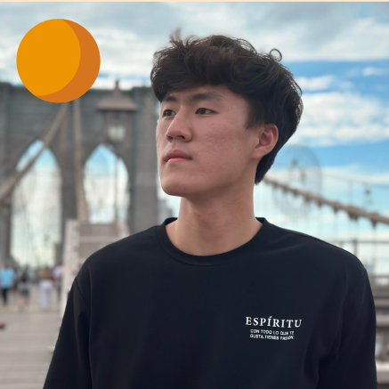
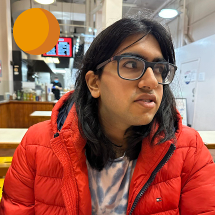
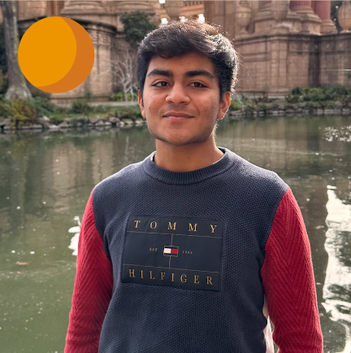

<h1 style="text-align: center;">SooHyuk Cho</h1>

**SooHyuk** is a junior double majoring in CS and DS. He's exploring various subfields of EECS; from computer system and architecture to robotics & control theory. He has research background in ML and computer architecture.

<h1 style="text-align: center;">Sameer Nayyar</h1>

**Sameer** is a junior pursuing major in EECS. He is interested in the field of control theory. He has some background in game theory research.

<h1 style="text-align: center;">Anish Dhanashekar</h1>

**Anish** is an EECS major currently exploring the field of robotics and control theory. His past research experience includes computer architecture and nanotechnology.
